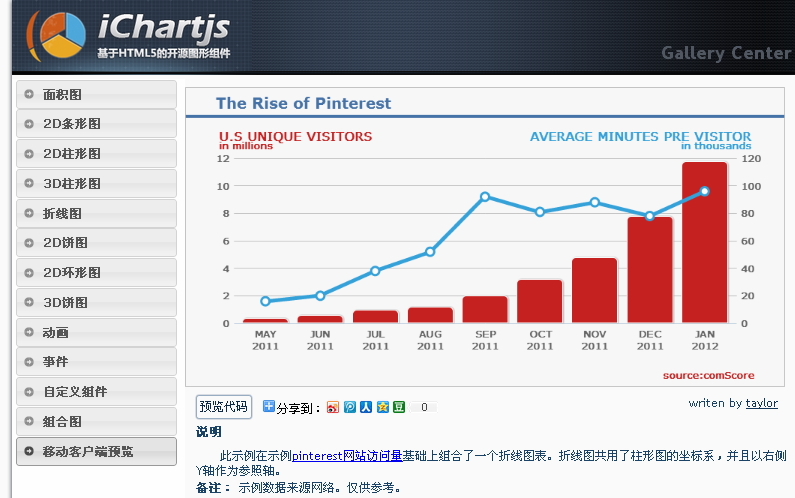

ichartjs是一款基于HTML5的图形图表库，使用纯JavaScript语言, 利用HTML5的canvas标签绘制各式图形，致力于为应用提供简单、直观、可交互的体验级图表组件。ichartjs基于Apache License 2.0协议开源，目前支持饼图、环形图、折线图、面积图、柱形图、条形图。

ichartjs是什么？
 
ichartjs 是一款基于HTML5的开源图表库。使用纯javascript语言, 利用HTML5的Canvas标签绘制各式图表。 目前ichartjs支持的图表类型有饼图、圆环图、柱形图、条形图、堆积图、折线图、面积图以及组合图。ichartjs致力于为您的应用提供简单、直观、可交互的体验级图表组件。是基于HTML5 WEB/Mobile APP图表展示方面的解决方案。目前官方的最新版本为ichartjs 1.1。
项目主页：http://www.ichartjs.com
图表示例：http://www.ichartjs.com/samples/
新浪微博：http://weibo.com/ichartjs/
Google code：http://code.google.com/p/ichartjs/
Github：https://github.com/wanghetommy/ichartjs
 
目前HTML5图表库有很多，为什么还要开发ichartjs？
 
开发ichartjs项目主要有以下几点原因：
ichartjs是在2011年4月份开始的，当时，HTML5不像2012年那么”火”，国内市场上基于HTML5流行的图表库也不像现在这么多，基于HTML5的项目也很少。但是市场已经对HTML5产生了浓厚的兴趣。
没有一款产品是适合所有行业的，特别是一些不常见的图表类型或者个性化需求。比如：材料力学性能状况分析(非线性图表)、石化炼油综合分析(油罐图)等。展望未来，在专业领域，这样的需求会越来越多。市场上这些常见的图表在绘制这类图表的显然能力不足。ichartjs也是基于此应运而生的，它适用于这类需求的个性化开发。
国内开源软件的氛围与国外存在一定的差距，我辈有义务、有责任贡献个人一点薄弱的力量，传播知识，传递理想。在国内，一般开源框架都首选国外的。如：struts，spring，Ruby on Rails等等。大家认为这些开源框架”安全”。而ichartjs定位是图表组件，这样的”组件”形式更能容易让大家所接受。在技术上更可控一些。
 
与其他图表库相比，ichartjs的优势是什么？
 
目前，从市场上来说，主要有Canvas、Svg、Flash。PC机上Flash表现强劲，Svg是目前解决跨平台比较好的方案，而真正用纯Canvas绘制图表的框架比较少。主要原因之一是IE6,7,8系列不支持Canvas标签。而ichartjs采用Canvas作为绘制图表的方案的原因是ichartjs致力于为基于HTML5的WEB/Mobile APP提供图表展示方面的解决方案。有关于Canvas、Svg、Flash等技术的对比大家可以在网络上获取，下面我们就几个方面将ichartjs与其他常见的几款图表库进行对比：

*RGraph免费的条件是要在使用的网站上链接RGraph网站
其实对于国内的部分开发者来说，ichartjs有一个不可小觑的优势是：便捷、实时、无障碍的交流。
 
浏览器兼容性如何？你是如何解决兼容问题的？
 
ichartjs利用HTML5的Canvas标签进行图表绘制，天生的跨平台属性着实解决了软件产品跨平台的问题。目前上，还有一部分浏览器不支持HTML5 Canvas(Text Api)特性。所以我们建议在移动项目或者HTML5的项目上使用ichartjs。
 
ichartjs在移动平台上表现如何？
 
ichartjs可以利用UIWebView与WebView组件在iOS 3+、Android 2.3+平台上运行，从目前大家的使用情况反馈上看，从交互性与渲染速度都可以达到理想状态。
移动平台的使用，大家要针对各个机型进行测试。另外，大家可以通过http://www.ichartjs.com/test/进行渲染速度测试。

